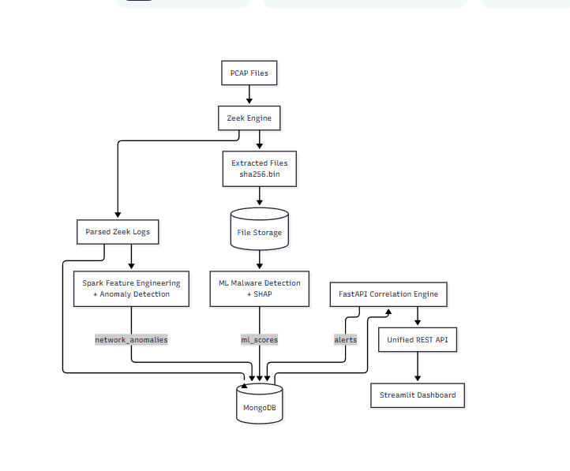
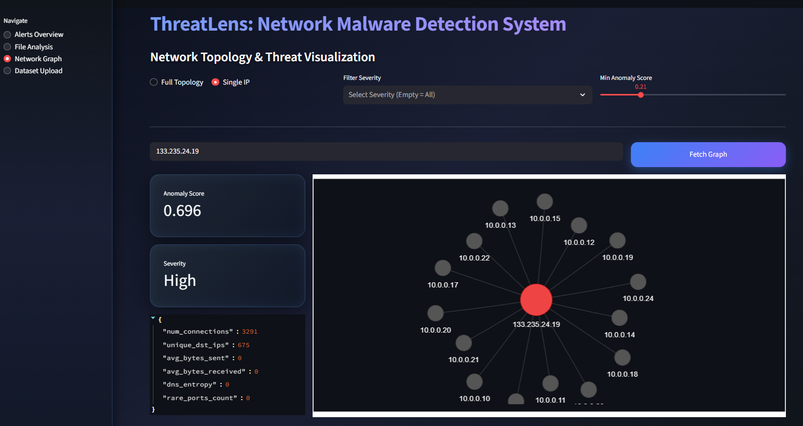
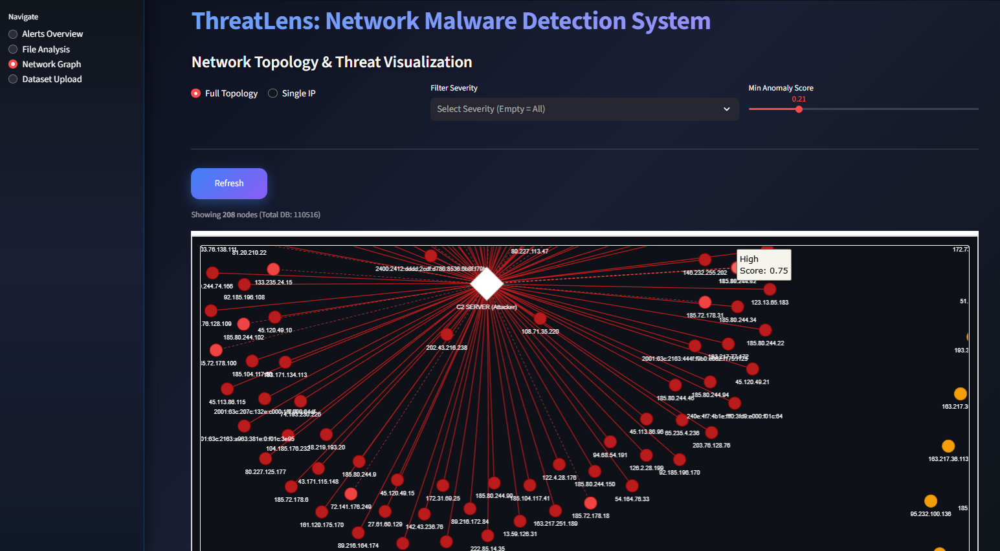
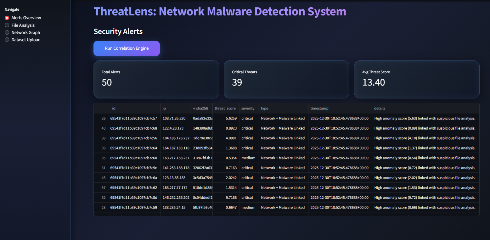

### Presentation & Demo Video - [link](https://drive.google.com/file/d/1YyV5KlUs3L0DJ-XGHfJCyljK6--a6aqB/view?usp=sharing)

# ThreatLens  
**File-Aware Network Malware Detection & Analytics Platform**

ThreatLens is an end-to-end cybersecurity analytics system that combines **network traffic analysis**, **static malware detection**, and **explainable machine learning** to analyze suspicious activity from PCAP files and present actionable insights through a unified pipeline and dashboard.

This project is designed as a **realistic, enterprise-style security system prototype**, focusing on architecture, data pipelines, and ML interpretability rather than toy detection scripts.

---

## Why ThreatLens Exists

Most academic malware projects stop at *“train a model and report accuracy.”*  
Real security systems don’t work like that.

ThreatLens is built to answer harder questions:

- How do you go from **raw PCAP files** to **structured intelligence**?
- How do you combine **network behavior** with **file-level malware signals**?
- How do you **explain** ML decisions to security analysts?
- How would this scale inside a SOC or enterprise pipeline?

---

## What ThreatLens Does

1. Ingests PCAP files  
2. Extracts network features using Zeek  
3. Extracts static file features (EMBER-style malware features)  
4. Processes data at scale using Apache Spark  
5. Classifies malicious behavior using ML models  
6. Explains predictions with SHAP  
7. Stores results in MongoDB  
8. Visualizes analytics in a dashboard for analysts  

This is not real-time detection by default.  
It is a **post-capture forensic and threat-analysis system**, similar to how many real SOC workflows operate.

---

## High-Level Architecture

PCAP Files  
→ Zeek (Network Logs)  
→ Spark Feature Engineering  
→ ML Classification  
→ SHAP Explainability  
→ MongoDB  
→ Analyst Dashboard

---
### Network Topology & Threat Visualization
The dashboard provides an interactive graph view of network entities, highlighting anomalous hosts, C2-style fan-out patterns, and severity-weighted connections.

The full topology view enables analysts to identify large-scale communication patterns, including centralized command-and-control–like structures and distributed scanning behavior.

## Threat Correlation & Alerts

ThreatLens correlates network-level anomalies with file-based malware indicators to generate prioritized security alerts. Each alert includes severity, threat score, timestamps, and linked evidence.

## Core Components

### Network Analysis
- PCAP parsing via Zeek  
- Protocol, flow, and behavior-level features  
- Designed for offline and batch analysis  

### Malware Detection
- Static file feature extraction (EMBER-style)  
- Gradient-boosting–based ML model  
- Focus on interpretability, not just accuracy  

### Big Data Pipeline
- Apache Spark for scalable feature processing  
- Modular pipeline structure (ingestion → transform → inference)  

### Explainability
- SHAP values to show **why** a file or flow was flagged  
- Analyst-friendly reasoning instead of black-box scores  

### Storage & Analytics
- MongoDB for structured results  
- Dashboard-ready schemas for visualization  

---

## Tech Stack

- Python  
- Zeek  
- Apache Spark  
- LightGBM / ML models  
- SHAP  
- MongoDB  
- Streamlit (Dashboard)  
- Docker (optional / planned)  

---

## Project Status

✔ Core pipeline implemented  
✔ ML model training & inference  
✔ SHAP explainability  
✔ Database integration  
✔ Dashboard prototype  

🚧 Real-time streaming (Kafka) – planned  
🚧 Production hardening – planned  
🚧 Cloud deployment – planned  

---

## Real-World Use Cases

- Post-incident PCAP analysis  
- Threat hunting and forensic investigations  
- Malware research and ML explainability demos  
- SOC analyst tooling prototypes  
- Security data engineering pipelines  

ThreatLens is **not a replacement** for commercial EDR/XDR tools.  
It demonstrates **how such systems are architected and built**.

---

## Repository Structure

threatlens/  
├── ml_pipeline/  
├── spark_pipeline/  
├── zeek_logs/  
├── web/   
├── docs/  
└── README.md  

---

## Target Audience

- Security engineers  
- ML / Big Data engineers  
- SOC tooling developers  
- Students building real systems  
- Recruiters evaluating end-to-end engineering ability  

---

## Disclaimer

This project is for **educational and research purposes only**.  
Not intended for production deployment without further hardening.

---

## Authors

Built and maintained by 

**Zohidjon Mahmudjonov** - Big Data & AI Engineer / CS @ Sejong Univeristy

**Nicholas Lexiene** - Network Engineer / CS @ Sejong Univeristy

**Natalia Perez** - ML Engineer / AI & Robotics @ Universitat Jaume I

**Iris Akdemir** - Software Engineer / CS @ Özyeğin University

---

## License

Apache-2.0 license
